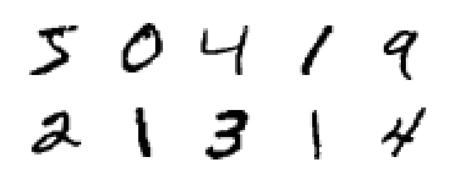

# MNIST Solver

The *Modified National Institute of Standards and Technology* database contains a large set of handwritten digits. Each are antialiased and normalised within a 28 by 28 grid. Labels are provided for each example and the data set is widely used to train artificial inteligence applications.

## Solution

This repository contains a simple web application which maps a canvas on the front-end to a neural network implementation on the server. The canvas supports both touchscreen and mouse input. A drawing on the canvas is resized and submitted to the server asynchronously, where it is processed and a prediction is formed. This value is returned to the client and displayed on the page.

## Deployment

Clone the repo and change into the new directory:

``
git clone https://github.com/alexander-neville/mnist_solver.git
cd mnist_solver
``

Create a virtual environment, activate it and install the set of dependencies:

``
virtualenv env
source env/bin
python3 -m pip install -r requirements.txt
``

An existing neural network configuration is included in the data directory. If you would rather train your own:

``
rm -f data/config.json
python3 train.py
``

To use the web interface, invoke python on the file `web_app.py` and head to **127.0.0.1:8000** to see the result.

## Acknowledgement

This neural network implementation is based on the maths laid out in Michael Nielsen's book on the subject. I forked one of the source files from a repository implementing these principles and adapted it for my requirements.

[Michael Nielsen's book on Neural Networks](http://neuralnetworksanddeeplearning.com/)  
[MichalDanielDobrzanski/DeepLearningPython](https://github.com/MichalDanielDobrzanski/DeepLearningPython)
